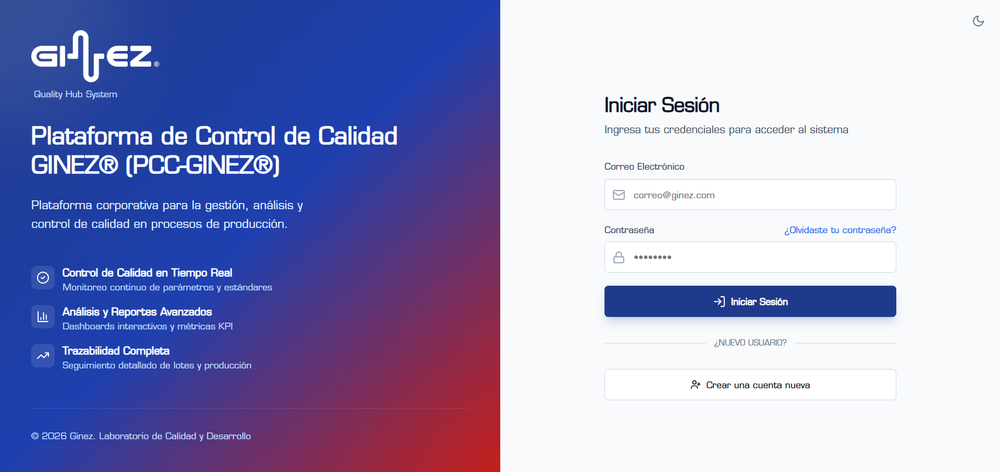
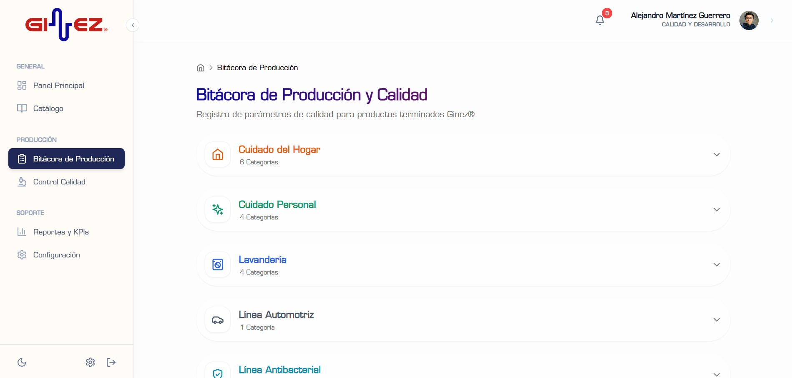
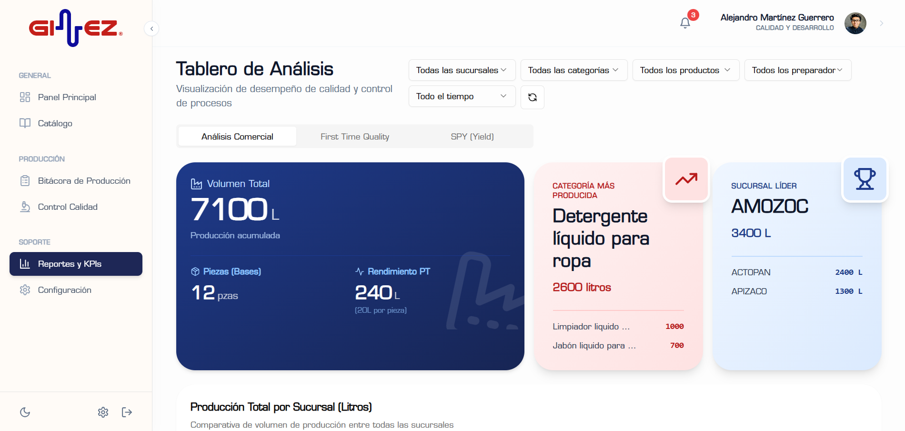
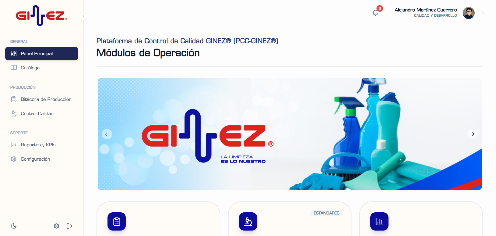

# Quality Hub GINEZ

Sistema integral de gestión de calidad y producción para GINEZ. Aplicación web progresiva diseñada para el control de procesos de calidad, análisis de producción, gestión de usuarios y consulta de documentación técnica.

---

## � Vista General del Sistema

### Inicio de Sesión


### Panel Principal


| Módulo | Vista |
|---|---|
| Bitácora de Producción |  |
| Control de Calidad / NCR |  |
| Reportes FTQ |  |
| Reportes Comercial |  |
| Banner / Capacitaciones |  |

---


## �📋 Tabla de Contenidos

- [Características Principales](#-características-principales)
- [Arquitectura del Sistema](#-arquitectura-del-sistema)
- [Módulos Funcionales](#-módulos-funcionales)
- [Stack Tecnológico](#-stack-tecnológico)
- [Seguridad y Control de Acceso](#-seguridad-y-control-de-acceso)
- [Configuración e Instalación](#️-configuración-e-instalación)
- [Estructura del Proyecto](#-estructura-del-proyecto)

---

## 🚀 Características Principales

### Control de Calidad Basado en Cartas de Control
- **Clasificación Automática**: Sistema de tres niveles (Conforme, Semi-Conforme, No Conforme) basado en límites de especificación y tolerancia
- **Cartas de Control Interactivas**: Visualización de % Sólidos y pH con líneas rojas (especificación) y amarillas (tolerancia ±5%)
- **Análisis en Tiempo Real**: Validación instantánea de mediciones contra estándares predefinidos

### Análisis de Producción Avanzado
- **KPIs Dinámicos**: Indicadores clave de rendimiento con filtros por fecha, sucursal y producto
- **Visualizaciones Interactivas**: Gráficos de barras, donut charts, cartas de control y análisis Pareto
- **Drill-Down Comercial**: Exploración detallada por familias y categorías de productos
- **Análisis de Variantes**: Visualización de top 20 productos por volumen de producción

### Gestión Integral de Bitácora
- **Registro Guiado**: Interfaz paso a paso para creación de lotes de producción
- **Generación Automática de Lotes**: Algoritmo inteligente basado en fecha, sucursal y producto
- **Validación Dinámica**: Campos que se activan según aplicabilidad de parámetros por familia

---

## 🏗️ Arquitectura del Sistema

### Arquitectura de Tres Capas

```
┌─────────────────────────────────────────────────────────────┐
│                     CAPA DE PRESENTACIÓN                     │
│  Next.js 14 (App Router) + React + Tailwind CSS + shadcn/ui │
└─────────────────────────────────────────────────────────────┘
                              ↕
┌─────────────────────────────────────────────────────────────┐
│                      CAPA DE LÓGICA                          │
│   • Análisis de Conformidad (Control Charts)                │
│   • Procesamiento de Datos (Agregaciones, KPIs)             │
│   • Validación de Negocio                                    │
│   • Gestión de Estado (React Hooks)                         │
└─────────────────────────────────────────────────────────────┘
                              ↕
┌─────────────────────────────────────────────────────────────┐
│                       CAPA DE DATOS                          │
│  Supabase (PostgreSQL) + Google Sheets (Catálogo Estático)  │
└─────────────────────────────────────────────────────────────┘
```

### Modelo de Datos

#### Tabla Principal: `bitacora_produccion`
```sql
- id (bigint, PK)
- created_at (timestamp)
- lote_producto (text)
- codigo_producto (text)
- sucursal (text)
- familia_producto (text)
- categoria_producto (text)
- fecha_fabricacion (date)
- tamano_lote (numeric)
- ph (numeric)
- solidos_medicion_1 (numeric)
- solidos_medicion_2 (numeric)
- apariencia (text)
- color (text)
- aroma (text)
- nombre_preparador (text)
- user_id (uuid, FK → auth.users)
```

#### Políticas de Seguridad (RLS)
- **Usuarios**: Solo pueden ver y editar sus propios registros
- **Administradores**: Acceso total a todos los registros
- **Auditoría**: Registro automático de todas las operaciones

---

## 📦 Módulos Funcionales

### 1. Panel Principal (Dashboard)
**Ruta**: `/`


**Características**:
- Resumen ejecutivo de producción
- Accesos rápidos a módulos principales
- Banner dinámico con anuncios y capacitaciones
- Indicadores de estado del sistema

---

### 2. Catálogo de Productos
**Ruta**: `/catalogo`

**Características**:
- **Sincronización con Google Sheets**: Datos en tiempo real de productos
- **Búsqueda Avanzada**: Filtrado por familia, categoría y tipo
- **Documentación Técnica**: Acceso directo a fichas técnicas y hojas de seguridad
- **Auditoría de Descargas**: Registro de accesos a documentos (solo admin)

**Fuentes de Datos**:
- Materia Prima: Google Sheets CSV
- Producto Terminado: Google Sheets CSV
- Documentos: Google Drive

---

### 3. Bitácora de Producción
**Ruta**: `/bitacora`


**Características**:
- **Wizard de Registro**: Interfaz guiada en 4 pasos
  1. Información del lote
  2. Mediciones de calidad
  3. Características organolépticas
  4. Confirmación y guardado
- **Generación Automática de Lotes**: Formato `YYYYMMDD-SUC-PROD-###`
- **Validación en Tiempo Real**: Feedback visual de conformidad
- **Campos Dinámicos**: Activación según aplicabilidad por familia

**Validaciones**:
- % Sólidos: Comparación contra `PRODUCT_STANDARDS`
- pH: Validación contra `PH_STANDARDS`
- Apariencia: Verificación contra `APPEARANCE_STANDARDS`

---

### 4. Control de Calidad
**Ruta**: `/calidad`


**Características**:
- **Historial de Mediciones**: Últimos 50 registros con estado visual
- **KPIs en Tiempo Real**:
  - Total de muestras
  - Conformes (verde)
  - Semi-Conformes (amarillo)
  - No Conformes (rojo)
- **Filtros Avanzados**:
  - Por rango de tiempo (7, 30, 90 días, todo)
  - Por sucursal
  - Por estado de conformidad
  - Búsqueda por lote/producto
- **Gestión de Registros**:
  - Edición inline (solo propios registros o admin)
  - Eliminación (solo admin)
  - Exportación de datos

**Lógica de Conformidad**:
```typescript
// Líneas rojas (especificación)
specMin = PRODUCT_STANDARDS[product].min
specMax = PRODUCT_STANDARDS[product].max

// Líneas amarillas (tolerancia ±5%)
warnMin = specMin * 0.95
warnMax = specMax * 1.05

// Clasificación
if (value >= specMin && value <= specMax) → CONFORME
else if (value >= warnMin && value <= warnMax) → SEMI-CONFORME
else → NO CONFORME
```

---

### 5. Reportes y Análisis
**Ruta**: `/reportes`

| Calidad FTQ | Comercial |
|---|---|
|  |  |

**Características**:

#### Tab 1: Calidad y Control
- **KPIs Principales**:
  - Total de registros
  - Volumen producido (L/Kg)
  - Piezas producidas
  - % Conformidad
- **Gráficos de Control**:
  - % Sólidos con límites de especificación y tolerancia
  - pH con límites de control
- **Análisis Pareto**: Defectos por parámetro (pH, Sólidos, Apariencia)
- **Conformidad por Sucursal**: Gráfico de barras apiladas

#### Tab 2: Análisis Comercial
- **Producción por Familia**: Donut charts interactivos
- **Drill-Down por Categorías**: Modales con desglose detallado
  - Cuidado del Hogar
  - Lavandería
  - Cuidado Personal
- **Ranking de Productos**: Top productos por volumen
- **Distribución de Variantes**: Top 20 productos por SKU
- **Producción por Sucursal**: Gráfico de barras comparativo

**Filtros Globales**:
- Rango de fechas personalizado
- Sucursal específica
- Familia de productos

---

### 6. Configuración
**Ruta**: `/configuracion`

**Características**:

#### Para Todos los Usuarios
- **Perfil Personal**:
  - Edición de nombre, área, puesto
  - Cambio de contraseña
  - Actualización de correo (requiere verificación)

#### Solo Administradores
- **Gestión de Usuarios**:
  - Listado completo de usuarios
  - Edición de roles (Usuario/Admin)
  - Eliminación de cuentas (preserva registros históricos)
  - Búsqueda y filtrado
- **Auditoría de Documentos**:
  - Registro de descargas de fichas técnicas
  - Historial de accesos a hojas de seguridad
  - Filtrado por usuario y fecha

---

## 🛠️ Stack Tecnológico

### Frontend
- **Framework**: [Next.js 14](https://nextjs.org/) (App Router)
- **UI Library**: [React 18](https://react.dev/)
- **Estilos**: [Tailwind CSS 3](https://tailwindcss.com/)
- **Componentes**: [shadcn/ui](https://ui.shadcn.com/)
- **Iconos**: [Lucide React](https://lucide.dev/)
- **Gráficos**: [Recharts](https://recharts.org/)
- **Notificaciones**: [Sonner](https://sonner.emilkowal.ski/)

### Backend & Database
- **BaaS**: [Supabase](https://supabase.com/)
  - PostgreSQL 15
  - Row Level Security (RLS)
  - Realtime subscriptions
  - Authentication & Authorization
- **Datos Estáticos**: Google Sheets (CSV export)
- **Almacenamiento**: Google Drive (documentos PDF)

### Herramientas de Desarrollo
- **Lenguaje**: TypeScript 5
- **Package Manager**: npm
- **Linting**: ESLint
- **Formateo**: Prettier (implícito)

---

## 🔐 Seguridad y Control de Acceso

### Modelo de Autenticación
- **Método**: Email + Password
- **Proveedor**: Supabase Auth
- **Sesiones**: JWT con refresh tokens
- **Verificación**: Email confirmation para cambios de correo

### Control de Acceso Basado en Roles (RBAC)

#### Rol: Usuario
**Permisos**:
- ✅ Ver catálogo de productos
- ✅ Crear registros de bitácora
- ✅ Ver solo sus propios registros en Control de Calidad
- ✅ Editar solo sus propios registros
- ✅ Ver reportes y análisis (datos globales)
- ✅ Editar su perfil personal
- ❌ Eliminar registros
- ❌ Ver registros de otros usuarios
- ❌ Gestionar usuarios
- ❌ Ver auditoría

#### Rol: Administrador
**Permisos**:
- ✅ Todos los permisos de Usuario
- ✅ Ver todos los registros de todos los usuarios
- ✅ Editar cualquier registro
- ✅ Eliminar registros
- ✅ Gestionar usuarios (crear, editar, eliminar)
- ✅ Cambiar roles de usuarios
- ✅ Ver auditoría completa
- ✅ Acceso a configuración global

### Row Level Security (RLS)

```sql
-- Política para usuarios normales
CREATE POLICY "Users can view own records"
ON bitacora_produccion FOR SELECT
USING (auth.uid() = user_id);

-- Política para administradores
CREATE POLICY "Admins can view all records"
ON bitacora_produccion FOR SELECT
USING (
  EXISTS (
    SELECT 1 FROM profiles
    WHERE profiles.id = auth.uid()
    AND profiles.is_admin = true
  )
);
```

---

## ⚙️ Configuración e Instalación

### 1. Requisitos Previos
- Node.js 18+ y npm
- Cuenta en [Supabase](https://supabase.com/)
- Acceso a Google Sheets (para catálogo)
- Acceso a Google Drive (para documentos)

### 2. Variables de Entorno

Crear archivo `.env.local` en la raíz:

```env
# Google Sheets (Catálogo)
SHEET_MP_CSV_URL="https://docs.google.com/spreadsheets/d/.../export?format=csv"
SHEET_PT_CSV_URL="https://docs.google.com/spreadsheets/d/.../export?format=csv"

# Supabase (Auth & Database)
NEXT_PUBLIC_SUPABASE_URL="https://tu-proyecto.supabase.co"
NEXT_PUBLIC_SUPABASE_ANON_KEY="tu-clave-anonima-publica"
```

### 3. Configuración de Supabase

#### Crear Tabla de Bitácora
```sql
CREATE TABLE bitacora_produccion (
  id BIGSERIAL PRIMARY KEY,
  created_at TIMESTAMPTZ DEFAULT NOW(),
  lote_producto TEXT NOT NULL,
  codigo_producto TEXT NOT NULL,
  sucursal TEXT NOT NULL,
  familia_producto TEXT,
  categoria_producto TEXT,
  fecha_fabricacion DATE NOT NULL,
  tamano_lote NUMERIC,
  ph NUMERIC,
  solidos_medicion_1 NUMERIC,
  solidos_medicion_2 NUMERIC,
  apariencia TEXT,
  color TEXT,
  aroma TEXT,
  nombre_preparador TEXT,
  user_id UUID REFERENCES auth.users(id)
);

-- Habilitar RLS
ALTER TABLE bitacora_produccion ENABLE ROW LEVEL SECURITY;
```

#### Crear Tabla de Perfiles
```sql
CREATE TABLE profiles (
  id UUID PRIMARY KEY REFERENCES auth.users(id),
  email TEXT,
  nombre TEXT,
  area TEXT,
  puesto TEXT,
  is_admin BOOLEAN DEFAULT false,
  created_at TIMESTAMPTZ DEFAULT NOW()
);
```

### 4. Instalación y Ejecución

```bash
# Clonar repositorio
git clone <repository-url>
cd QualityHub

# Instalar dependencias
npm install

# Iniciar servidor de desarrollo
npm run dev
# Disponible en http://localhost:3000

# Build para producción
npm run build
npm start
```

---

## 📁 Estructura del Proyecto

```
QualityHub/
├── app/                          # Next.js App Router
│   ├── (auth)/                   # Rutas de autenticación
│   │   └── login/
│   ├── bitacora/                 # Módulo de bitácora
│   ├── calidad/                  # Control de calidad
│   ├── catalogo/                 # Catálogo de productos
│   ├── configuracion/            # Configuración y usuarios
│   ├── reportes/                 # Reportes y análisis
│   ├── layout.tsx                # Layout principal
│   └── page.tsx                  # Dashboard
├── components/                   # Componentes React
│   ├── ui/                       # shadcn/ui components
│   ├── AppShell.tsx              # Shell de aplicación
│   ├── AuthProvider.tsx          # Proveedor de autenticación
│   └── Breadcrumbs.tsx           # Navegación breadcrumb
├── lib/                          # Utilidades y lógica
│   ├── analysis-utils.ts         # Análisis de conformidad
│   ├── production-constants.ts   # Estándares de productos
│   ├── supabase.ts               # Cliente de Supabase
│   └── utils.ts                  # Utilidades generales
├── public/                       # Archivos estáticos
├── .env.local                    # Variables de entorno (no versionado)
├── next.config.js                # Configuración de Next.js
├── tailwind.config.ts            # Configuración de Tailwind
├── tsconfig.json                 # Configuración de TypeScript
└── package.json                  # Dependencias del proyecto
```

---

## 📊 Lógica de Análisis de Conformidad

### Control Chart Logic

El sistema utiliza cartas de control estadístico para clasificar la conformidad de los lotes:

```typescript
// Límites de Especificación (Líneas Rojas)
const specMin = PRODUCT_STANDARDS[product].min
const specMax = PRODUCT_STANDARDS[product].max

// Límites de Tolerancia (Líneas Amarillas) - 5% de error relativo
const warnMin = specMin * 0.95
const warnMax = specMax * 1.05

// Clasificación de Conformidad
function classifyConformity(value: number): ConformityLevel {
  if (value >= specMin && value <= specMax) {
    return 'conforme'        // Entre líneas rojas
  } else if (value >= warnMin && value <= warnMax) {
    return 'semi-conforme'   // Entre líneas rojas y amarillas
  } else {
    return 'no-conforme'     // Fuera de líneas amarillas
  }
}
```

### Parámetros Evaluados
1. **% Sólidos** (principal): Determina conformidad general
2. **pH**: Validación secundaria
3. **Apariencia**: Verificación cualitativa

---

## 🔄 Flujo de Trabajo Típico

1. **Login** → Usuario se autentica
2. **Dashboard** → Vista general del sistema
3. **Bitácora** → Registro de nuevo lote de producción
4. **Validación** → Sistema evalúa conformidad en tiempo real
5. **Guardado** → Registro almacenado en Supabase
6. **Control de Calidad** → Revisión de historial y estado
7. **Reportes** → Análisis de tendencias y KPIs
8. **Configuración** → Gestión de perfil y usuarios (admin)

---

## 📝 Notas de Implementación

### Validación de Correos
Los cambios de correo electrónico requieren confirmación vía email. La interfaz se actualiza inmediatamente para evitar confusión, pero el login requiere el correo confirmado.

### Integridad de Datos
Al eliminar un usuario, sus registros históricos se conservan para trazabilidad. Solo se revoca el acceso a la cuenta.

### Sincronización de Catálogo
Los datos del catálogo se actualizan desde Google Sheets en cada carga de página. Para mejor rendimiento, considerar implementar caché con revalidación periódica.

### Optimización de Rendimiento
- Uso de `useMemo` para cálculos pesados
- Filtrado client-side para respuesta inmediata
- Lazy loading de componentes pesados
- Optimización de imágenes con Next.js Image

---

## 🚀 Roadmap Futuro

- [ ] Exportación de reportes a PDF/Excel
- [ ] Notificaciones en tiempo real para lotes no conformes
- [ ] Dashboard de tendencias predictivas
- [ ] Integración con sistema ERP
- [ ] App móvil nativa (React Native)
- [ ] Módulo de gestión de inventarios
- [ ] Sistema de alertas automáticas
- [ ] API REST para integraciones externas

---

## 📄 Licencia

**Uso interno exclusivo para GINEZ.**  
Todos los derechos reservados © 2024-2026 GINEZ

---

## 👥 Soporte y Contacto

Para soporte técnico o consultas sobre el sistema, contactar al equipo de desarrollo interno.
