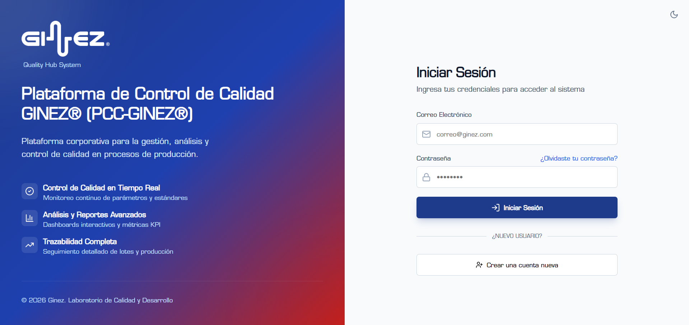
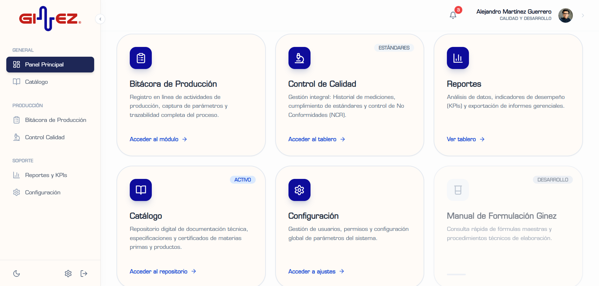
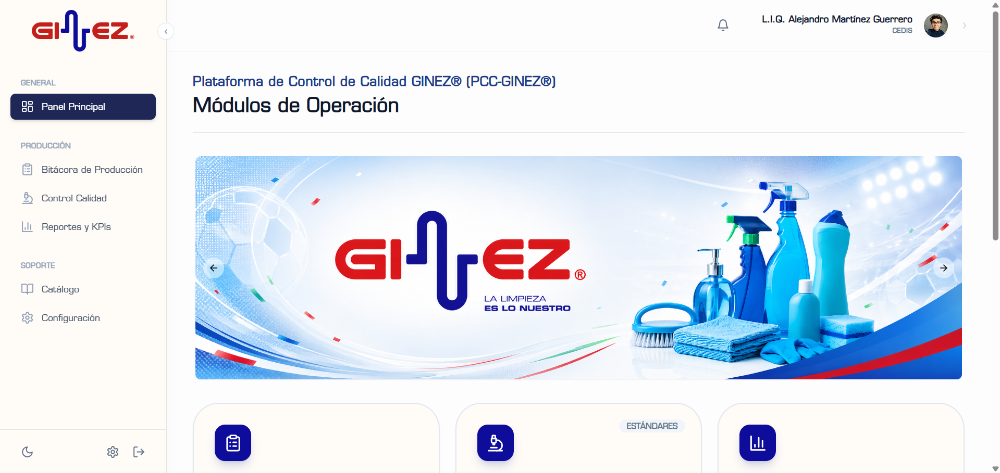
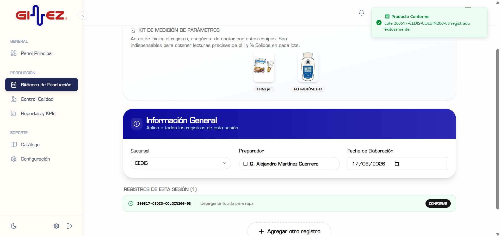
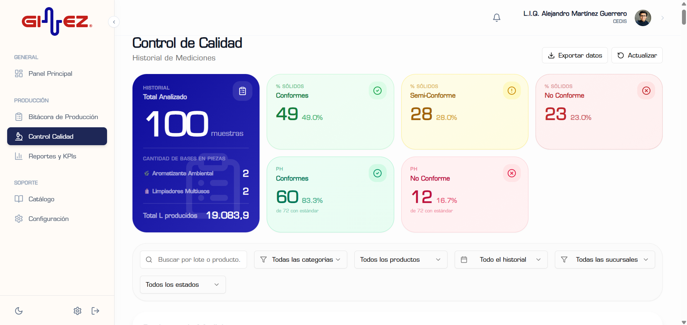
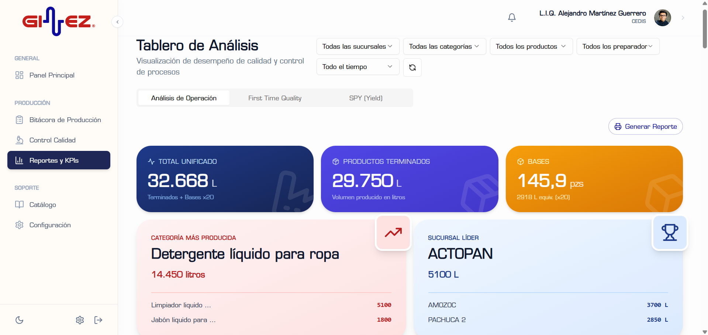
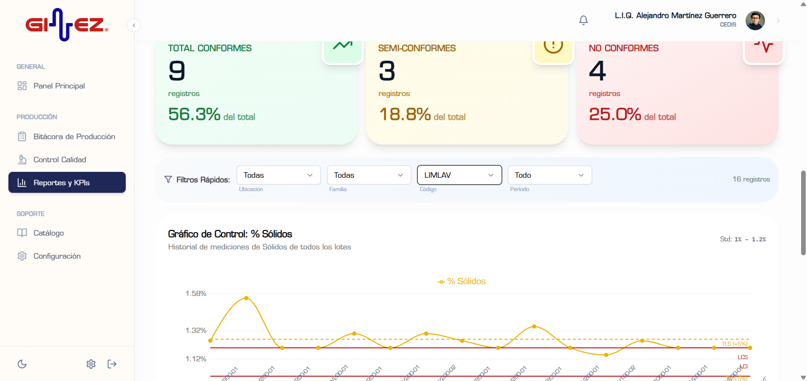
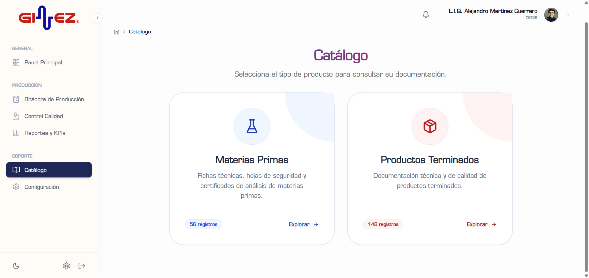
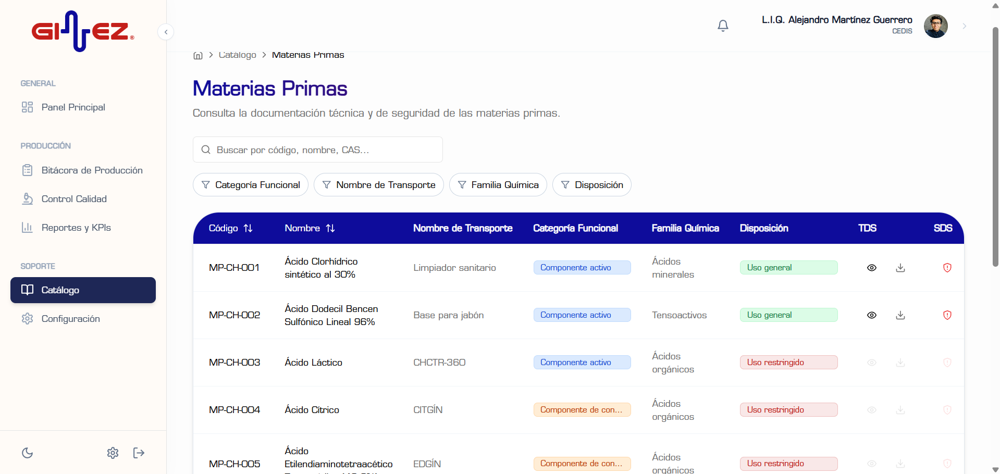

# Quality Hub GINEZ — PCC-GINEZ®

**Plataforma de Control de Calidad GINEZ® (PCC-GINEZ®)**
Sistema corporativo de gestión de calidad y producción para OPERADORA GINEZ DE MÉXICO. Aplicación web privada con autenticación, diseñada para el control de procesos de calidad, análisis de producción, gestión de No Conformidades (NCR), y consulta de documentación técnica (~40 sucursales).

---

## 📸 Vista General del Sistema

### Inicio de Sesión


### Panel Principal con Banner Corporativo
| Panel de Módulos | Banner / Carrusel |
|---|---|
|  |  |

### Módulos Principales

| Módulo | Vista |
|---|---|
| Bitácora de Producción |  |
| Control de Calidad |  |
| Reportes — Análisis de Operación |  |
| Reportes — First Time Quality |  |
| Cartas de Control (% Sólidos) |  |
| Catálogo MP / PT |  |
| Catálogo — Materias Primas |  |

---

## 📋 Tabla de Contenidos

- [Características Principales](#-características-principales)
- [Arquitectura del Sistema](#️-arquitectura-del-sistema)
- [Módulos Funcionales](#-módulos-funcionales)
- [Stack Tecnológico](#️-stack-tecnológico)
- [Seguridad y Control de Acceso](#-seguridad-y-control-de-acceso)
- [Configuración e Instalación](#️-configuración-e-instalación)
- [Estructura del Proyecto](#-estructura-del-proyecto)
- [CI/CD y Despliegue](#-cicd-y-despliegue)

---

## 🚀 Características Principales

### Control de Calidad Basado en Cartas de Control
- **Clasificación Automática de Tres Niveles**: Conforme, Semi-Conforme, No Conforme — basado en límites de especificación y tolerancia ±5%
- **Cartas de Control Interactivas**: Visualización de % Sólidos y pH con líneas rojas (especificación) y amarillas (tolerancia)
- **Generación Automática de NCR**: Cuando un lote resulta No Conforme, se crea automáticamente un registro de No Conformidad con flujo ABIERTO → EN_MRB → CERRADO
- **Chat por Medición**: Conversación en tiempo real asociada a cada registro de calidad

### Tablero de Análisis y Reportes
- **Tres Tabs Especializados**: Análisis de Operación, First Time Quality (FTQ), SPY (Yield)
- **KPIs Dinámicos**: Total Unificado (L), Productos Terminados, Bases (pzs con conversión ×20), Categoría Más Producida, Sucursal Líder
- **Pareto de Defectos**: Frecuencia de fallos por parámetro (Sólidos, pH, Apariencia)
- **Conformidad por Sucursal**: Gráfico de barras apiladas conforme vs no conforme
- **Filtros Globales**: Sucursal, categoría, código de producto, periodo de tiempo y preparador
- **Generación de Reportes**: Exportación imprimible de informes

### Gestión Integral de Bitácora
- **Wizard de 4 Pasos**: Información General → Selección de Producto → Mediciones → Confirmación
- **Kit de Medición Visual**: Instrucciones con imágenes de Tiras pH y Refractómetro
- **Registro Multi-Lote por Sesión**: Agregar múltiples registros sin recargar la página
- **Generación Automática de Lotes**: Formato `YYMMDD-SUCURSAL-CÓDIGO-##`
- **Validación Dinámica**: Campos que se activan según aplicabilidad por familia de producto

### Sistema de Notificaciones
- **NotificationBell**: Polling cada 30 segundos con contador de no leídas
- **Notificaciones por NCR**: Alertas automáticas para administradores cuando se genera una No Conformidad
- **Chat de Calidad**: Notificaciones de mensajes no leídos en mediciones
- **Recordatorio de Calibración**: Alertas periódicas para calibración de refractómetro

### Catálogo de Productos
- **56 Materias Primas** y **148 Productos Terminados** (datos desde Google Sheets)
- **Búsqueda Fuzzy**: Powered by Fuse.js — buscar por código, nombre, CAS, nombre de transporte
- **Filtros Avanzados**: Categoría Funcional, Nombre de Transporte, Familia Química, Disposición
- **Documentación con Google Drive**: Botones Ver/Descargar para TDS, SDS, COA y etiquetado
- **Navegación Jerárquica PT**: Familia → Categoría → SKU con breadcrumbs

---

## 🏗️ Arquitectura del Sistema

### Arquitectura de Tres Capas

```
┌──────────────────────────────────────────────────────────────────┐
│                      CAPA DE PRESENTACIÓN                        │
│   Next.js 14 (App Router) · React 18 · Tailwind CSS · shadcn/ui │
│   Recharts · Framer Motion · Embla Carousel · Fuse.js            │
└──────────────────────────────────────────────────────────────────┘
                                ↕
┌──────────────────────────────────────────────────────────────────┐
│                       CAPA DE LÓGICA                             │
│   • Análisis de Conformidad (analysis-utils.ts)                  │
│   • Estándares de Producto (production-constants.ts)             │
│   • RBAC con 10 Roles (usePermissions.ts)                        │
│   • Validaciones (validations.ts + Zod)                          │
│   • Rate Limiting · Sanitización · Auditoría                     │
└──────────────────────────────────────────────────────────────────┘
                                ↕
┌──────────────────────────────────────────────────────────────────┐
│                        CAPA DE DATOS                             │
│   Supabase Self-Hosted (PostgreSQL 15 + RLS + Auth PKCE)         │
│   Google Sheets (Catálogo CSV) · Google Drive (PDFs)             │
└──────────────────────────────────────────────────────────────────┘
```

### Modelo de Datos

#### Tabla Principal: `bitacora_produccion_calidad`
```sql
id (bigint, PK)
created_at (timestamptz)
lote_producto (text)
codigo_producto (text)
sucursal (text)
familia_producto (text)
categoria_producto (text)
fecha_fabricacion (date)
tamano_lote (numeric)
ph (numeric)
solidos_medicion_1 (numeric)
solidos_medicion_2 (numeric)
apariencia (text)
color (text)
aroma (text)
nombre_preparador (text)
user_id (uuid, FK → auth.users)
observaciones (text)
```

#### Tabla: `profiles`
```sql
id (uuid, PK, FK → auth.users)
email (text)
full_name (text)
area (text)
position (text)
role (text)           -- admin, gerente_calidad, coordinador, etc.
is_admin (boolean)    -- sincronizado por trigger
approved (boolean)
sucursal (text)
avatar_url (text)
```

#### Tabla: `quality_ncr`
```sql
id, created_at, bitacora_id (FK)
status (text)         -- ABIERTO → EN_MRB → CERRADO
-- + campos de resolución y seguimiento
```

#### Tabla: `notifications`
```sql
id, user_id (FK), type (text)
title (text), message (text), link (text)
read (boolean), created_at
```

#### RPCs (Funciones PostgreSQL)
- `get_user_permissions_v2()` — Permisos por rol
- `rpc_ncr_list()` — Listado de NCR con filtros avanzados
- `rpc_measurement_chat_unread()` — Conteo de mensajes no leídos

---

## 📦 Módulos Funcionales

### 1. Panel Principal (Dashboard)
**Ruta**: `/`

- **Banner Dinámico**: Carrusel de 6 slides con autoplay cada 4 segundos (Embla Carousel)
- **Cards de Módulos**: Accesos rápidos con visibilidad controlada por rol
- **Notificaciones**: Campana con polling cada 30s y contador de no leídas
- **Perfil**: Nombre, área, avatar en la barra superior

### 2. Bitácora de Producción
**Ruta**: `/bitacora`

- **Wizard Guiado de 4 Pasos** con instrucciones visuales del kit de medición (Tiras pH + Refractómetro)
- **Información General de Sesión**: Sucursal, Preparador (auto-llenado), Fecha
- **Registro Multi-Lote**: Agregar varios lotes en una misma sesión
- **Feedback Visual**: Badge CONFORME/SEMI-CONFORME/NO CONFORME en tiempo real
- **Generación Automática de Lote**: `YYMMDD-SUCURSAL-CÓDIGO-##`
- **Campos Dinámicos**: Activación según familia (ej: bases miden en piezas, no en litros)

### 3. Control de Calidad
**Ruta**: `/calidad`

- **KPIs en Tiempo Real**: 100 muestras → 49 Conformes (49%) / 28 Semi-Conformes (28%) / 23 No Conformes (23%)
- **KPIs de pH**: Conformes vs No Conformes (de registros con estándar)
- **Cantidad de Bases en Piezas**: Desglose por tipo (Aromatizante Ambiental, Limpiadores Multiusos)
- **Total Litros Producidos**: Volumen acumulado
- **Filtros Avanzados**: Búsqueda por lote/producto, categoría, producto, historial, sucursal, estado
- **Gestión NCR**: Flujo automático ABIERTO → EN_MRB → CERRADO
- **Chat por Medición**: Conversación asociada a cada registro
- **Exportar Datos** y **Actualizar** en tiempo real

### 4. Reportes y KPIs
**Ruta**: `/reportes`

#### Tab 1: Análisis de Operación
- **KPIs Hero**: Total Unificado (L), Productos Terminados (L), Bases (pzs + equivalencia ×20)
- **Categoría Más Producida** y **Sucursal Líder**
- **Rankings**: Categorías por volumen, sucursales por producción
- **Filtros**: Sucursales, categorías, productos, preparadores, periodo

#### Tab 2: First Time Quality (FTQ)
- **Total Registros** y **Volumen Total Producido**
- **Pareto de Defectos**: Frecuencia por parámetro (Sólidos, pH, Apariencia) con % acumulado
- **Conformidad por Sucursal**: Barras apiladas conforme vs no conforme
- **Cartas de Control**: % Sólidos y pH con líneas de especificación (rojas) y tolerancia (amarillas)

#### Tab 3: SPY (Yield)
- Métricas de rendimiento de producción

### 5. Catálogo
**Ruta**: `/catalog`

- **Materias Primas** (`/catalog/raw-materials`): Tabla con 56 registros, columnas Código, Nombre, Nombre de Transporte, Categoría Funcional, Familia Química, Disposición, TDS, SDS
- **Detalle MP** (`/catalog/raw-materials/[code]`): Cards de clasificación química, seguridad/transporte, almacén + sección de documentación
- **Productos Terminados** (`/catalog/finished-products`): Navegación jerárquica Familia → Categoría → SKU (148 registros)
- **Detalle PT** (`/catalog/finished-products/[family]/[category]/[sku]`): Información general + documentación
- **Búsqueda Fuzzy** (Fuse.js) + **Filtros Multi-Select** por categoría funcional, familia química, disposición
- **Documentos en Google Drive**: Botones Ver (iframe) y Descargar para TDS, SDS, COA, Etiquetado

### 6. Configuración
**Ruta**: `/configuracion`

- **Perfil Personal**: Edición de nombre, área, puesto, avatar. Cambio de contraseña y correo
- **Gestión de Usuarios** (`/configuracion/usuarios`, solo admin): Listado, edición de roles, aprobación, eliminación segura vía Admin API

---

## 🛠️ Stack Tecnológico

### Frontend
| Tecnología | Versión | Uso |
|---|---|---|
| [Next.js](https://nextjs.org/) | 14 (App Router) | Framework SSR/SSG |
| [React](https://react.dev/) | 18 | UI Library |
| [TypeScript](https://www.typescriptlang.org/) | 5 | Tipado estático |
| [Tailwind CSS](https://tailwindcss.com/) | 3 | Estilos utilitarios |
| [shadcn/ui](https://ui.shadcn.com/) | — | Componentes UI (Radix) |
| [Lucide React](https://lucide.dev/) | 0.316 | Iconos |
| [Recharts](https://recharts.org/) | 3.x | Gráficos y cartas de control |
| [Framer Motion](https://www.framer.com/motion/) | 12.x | Animaciones |
| [Embla Carousel](https://www.embla-carousel.com/) | 8.x | Banner carrusel con autoplay |
| [Fuse.js](https://www.fusejs.io/) | 7.x | Búsqueda fuzzy |
| [Sonner](https://sonner.emilkowal.ski/) | 2.x | Notificaciones toast |
| [TanStack Table](https://tanstack.com/table) | 8.x | Tablas con sorting/filtrado |

### Backend & Database
| Tecnología | Uso |
|---|---|
| [Supabase](https://supabase.com/) (Self-Hosted) | PostgreSQL 15, RLS, Auth PKCE, Realtime |
| Google Sheets | Datos de catálogo (CSV export) |
| Google Drive | Almacenamiento de PDFs (TDS, SDS, COA) |
| [Resend](https://resend.com/) | Envío de correos transaccionales |

### DevOps
| Tecnología | Uso |
|---|---|
| Docker | Contenedor de producción (GHCR) |
| GitHub Actions | CI/CD automático en push a `main` |
| Hostinger VPS | Servidor de producción |

---

## 🔐 Seguridad y Control de Acceso

### Modelo de Autenticación
- **Método**: Email + Password con opción de crear cuenta nueva (requiere aprobación admin)
- **Proveedor**: Supabase Auth con flujo PKCE
- **Sesiones**: JWT con refresh tokens automáticos, storage key `pcc-ginez-auth`
- **Safety Timer**: 8 segundos máximo de espera en inicialización de auth

### Control de Acceso Basado en Roles (RBAC) — 10 Roles

| Rol | Bitácora | Control Calidad | Reportes | Catálogo | Config | Usuarios |
|---|:---:|:---:|:---:|:---:|:---:|:---:|
| `admin` | ✅ | ✅ | ✅ | ✅ | ✅ | ✅ |
| `gerente_calidad` | ✅ | ✅ | ✅ | ✅ | ✅ | ❌ |
| `coordinador` | ✅ | ✅ | ✅ | ✅ | ✅ | ❌ |
| `director_operaciones` | ❌ | ❌ | ✅ | ✅ | ✅ | ❌ |
| `director_compras` | ❌ | ❌ | ✅ | ✅ | ✅ | ❌ |
| `gerente_sucursal` | ❌ | ✅ | ❌ | ✅ | ✅ | ❌ |
| `gerente` | ❌ | ✅ | ❌ | ✅ | ✅ | ❌ |
| `preparador` | ✅ | ❌ | ✅ | ✅ | ✅ | ❌ |
| `mostrador` / `cajera` | ❌ | ❌ | ❌ | ✅ | ✅ | ❌ |
| `vendedor` | ❌ | ❌ | ❌ | ✅ | ✅ | ❌ |

### Row Level Security (RLS)
- **Usuarios**: Solo pueden ver y editar sus propios registros
- **Administradores**: Acceso total a todos los registros
- **Eliminación de Usuarios**: Siempre vía Admin API (`/api/admin/delete-user`), nunca SQL directo

---

## ⚙️ Configuración e Instalación

### 1. Requisitos Previos
- Node.js 18+ y npm
- Instancia de Supabase (self-hosted o cloud) con PostgreSQL 15
- Google Sheets publicado como CSV (para catálogo)
- Google Drive con permisos públicos de lectura (para PDFs)

### 2. Variables de Entorno

Crear archivo `.env` en la raíz:

```env
# Google Sheets (Catálogo)
SHEET_MP_CSV_URL="https://docs.google.com/spreadsheets/d/e/.../pub?output=csv"
SHEET_PT_CSV_URL="https://docs.google.com/spreadsheets/d/e/.../pub?output=csv"

# Next.js
NEXT_PUBLIC_BASE_PATH=""

# Supabase
NEXT_PUBLIC_SUPABASE_URL="https://tu-instancia-supabase"
NEXT_PUBLIC_SUPABASE_ANON_KEY="tu-clave-anonima"

# Supabase Service Role (SOLO server-side, NUNCA exponer en frontend)
# SUPABASE_SERVICE_ROLE_KEY="..."

# Resend (correos transaccionales)
RESEND_API_KEY="re_..."
```

### 3. Instalación y Ejecución

```bash
# Clonar repositorio
git clone https://github.com/AlejandroMartinezG/quality-hub.git
cd quality-hub

# Instalar dependencias
npm install

# Generar datos de catálogo (usa datos de ejemplo si no hay URLs configuradas)
node scripts/build-data.mjs

# Iniciar servidor de desarrollo
npm run dev
# Disponible en http://localhost:3000

# Build para producción
npm run build
npm start
```

---

## 📁 Estructura del Proyecto

```
quality-hub/
├── app/
│   ├── page.tsx                                    # Dashboard (cards módulos + DashboardBanner)
│   ├── layout.tsx                                  # Layout global (AuthProvider + AppShell)
│   ├── globals.css                                 # Estilos globales
│   ├── login/page.tsx                              # Inicio de sesión
│   ├── auth/invite/                                # Flujo de invitación de usuarios
│   ├── bitacora/page.tsx                           # Wizard de registro de lotes (4 pasos)
│   ├── calidad/page.tsx                            # Historial mediciones, KPIs, chat, NCR
│   ├── reportes/page.tsx                           # Tablero de Análisis (3 tabs)
│   ├── catalog/
│   │   ├── page.tsx                                # Selector MP / PT
│   │   ├── raw-materials/
│   │   │   ├── page.tsx                            # Tabla de Materias Primas
│   │   │   └── [code]/page.tsx                     # Detalle de Materia Prima
│   │   └── finished-products/
│   │       ├── page.tsx                            # Familias de PT
│   │       └── [family]/
│   │           ├── page.tsx                        # Categorías de familia
│   │           └── [category]/
│   │               ├── page.tsx                    # Productos de categoría
│   │               └── [sku]/page.tsx              # Detalle de PT
│   ├── configuracion/
│   │   ├── page.tsx                                # Perfil personal
│   │   └── usuarios/page.tsx                       # Gestión de usuarios (admin)
│   └── api/admin/
│       ├── delete-user/                            # Eliminar usuario (service role)
│       ├── invite-user/                            # Invitar usuario
│       └── update-user/                            # Actualizar usuario
├── components/
│   ├── ui/                         # shadcn/ui (Button, Card, Badge, Dialog, etc.)
│   ├── AppShell.tsx                # Sidebar colapsable + navbar + mobile menu
│   ├── AuthProvider.tsx            # Contexto global auth (PKCE + safety timer 8s)
│   ├── DashboardBanner.tsx         # Carrusel 6 slides (Embla + autoplay 4s)
│   ├── NotificationBell.tsx        # Polling 30s, borrar individual/todo
│   ├── DataTable.tsx               # Tabla genérica con TanStack Table
│   ├── SearchInput.tsx             # Búsqueda con Fuse.js
│   ├── Filters.tsx                 # Filtros multi-select
│   ├── DocCard.tsx                 # Card de documento (Ver/Descargar Drive)
│   ├── InfoCard.tsx                # Card de información
│   ├── Breadcrumbs.tsx             # Navegación breadcrumb
│   ├── PrintReportWrapper.tsx      # Wrapper para impresión de reportes
│   └── DeleteConfirmationDialog.tsx
├── lib/
│   ├── supabase.ts                 # Cliente anon key (client-side)
│   ├── supabase-admin.ts           # Cliente service role (SOLO server-side)
│   ├── analysis-utils.ts           # analyzeRecord(), EnrichedRecord, lógica conformidad
│   ├── production-constants.ts     # PRODUCT_STANDARDS, PH_STANDARDS, SUCURSALES
│   ├── usePermissions.ts           # Hook de permisos por rol
│   ├── validations.ts              # Schemas Zod para formularios
│   ├── rate-limit.ts               # Rate limiting para login
│   ├── sanitize.ts                 # Sanitización de inputs
│   ├── audit.ts                    # Registro de auditoría
│   ├── logger.ts                   # Logger del sistema
│   ├── types.ts                    # Tipos TypeScript compartidos
│   └── utils.ts                    # cn(), getBasePath()
├── data/                           # JSON generado por build-data.mjs
│   ├── raw-materials.json
│   └── finished-products.json
├── scripts/
│   └── build-data.mjs              # CSV → JSON + URLs de Google Drive
├── supabase/
│   ├── migrations/                 # 17 migraciones SQL
│   └── rpc_spy_summary.sql
├── public/
│   ├── banners/                    # Slides del carrusel
│   ├── images/                     # Imágenes del sistema
│   ├── fonts/                      # Tipografías personalizadas
│   ├── logo.png / logo-small.png
│   └── capturas_proyecto_quality_hub/
├── .github/workflows/
│   └── deploy.yml                  # CI/CD → Docker → VPS
├── Dockerfile                      # Build multi-stage para producción
├── docker-compose.yml              # Orquestación en VPS
├── next.config.js
├── tailwind.config.js
├── tsconfig.json
└── package.json
```

---

## 📊 Lógica de Análisis de Conformidad

### Clasificación de Conformidad

```
Líneas Rojas (Especificación):
  specMin = PRODUCT_STANDARDS[product].min
  specMax = PRODUCT_STANDARDS[product].max

Líneas Amarillas (Tolerancia ±5%):
  warnMin = specMin × 0.95
  warnMax = specMax × 1.05

Clasificación:
  valor ∈ [specMin, specMax]     → CONFORME       (verde)
  valor ∈ [warnMin, warnMax]     → SEMI-CONFORME  (amarillo)
  valor fuera de [warnMin, warnMax] → NO CONFORME  (rojo) → auto-crea NCR
```

### Parámetros Evaluados
1. **% Sólidos** (principal): Determina conformidad general (`overallStatus = solidsStatus`)
2. **pH**: Validación secundaria contra `PH_STANDARDS`
3. **Apariencia**: Verificación cualitativa contra `APPEARANCE_STANDARDS`

### Familias de Bases (PIECE_FAMILIES)
Las familias de bases ("Bases aromatizante ambiental", "Bases limpiadores líquidos multiusos", "Bases Aromatizantes") se miden en **piezas** y se convierten a litros con factor **×20**. En tablas y reportes se muestra `pzs` en lugar de `L`.

---

## 🔄 Flujo de Trabajo

1. **Login** → Autenticación con email/password
2. **Dashboard** → Panel con módulos según rol + banner corporativo
3. **Bitácora** → Registro guiado de lotes con kit de medición visual
4. **Validación** → Clasificación automática: Conforme / Semi-Conforme / No Conforme
5. **NCR** → Si No Conforme, se genera NCR automáticamente (ABIERTO)
6. **Control de Calidad** → Revisión de historial, KPIs, chat por medición
7. **Reportes** → Análisis de Operación, FTQ, Pareto, Conformidad por Sucursal
8. **Catálogo** → Consulta de documentación técnica (TDS, SDS, COA)
9. **Configuración** → Perfil personal + gestión de usuarios (admin)

---

## 🚀 CI/CD y Despliegue

Cada **push a `main`** dispara automáticamente el pipeline de GitHub Actions:

```
Push a main
  → Build imagen Docker multi-stage
  → Push a GitHub Container Registry (ghcr.io)
  → Deploy automático en VPS Hostinger via docker-compose
```

**Convenciones de deployment**:
- Imágenes en `public/` requieren `git add` explícito por nombre (son binarios)
- No usar `&&` en comandos git — ejecutarlos línea por línea
- La imagen Docker se publica como `ghcr.io/AlejandroMartinezG/quality-hub-ginez:latest`

---

## 📄 Licencia

**Uso interno exclusivo para OPERADORA GINEZ DE MÉXICO.**
Todos los derechos reservados © 2024-2026 GINEZ

---

## 👥 Soporte

Para soporte técnico o consultas sobre el sistema, contactar al equipo de Calidad y Desarrollo.
